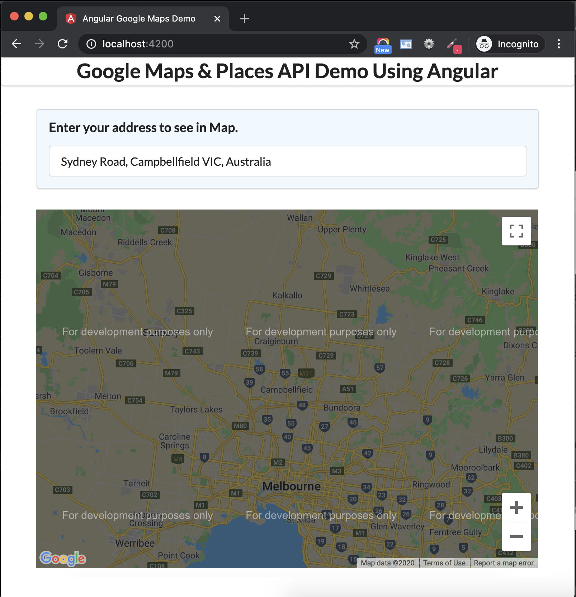

# Google Maps and Places API

This project was generated with [Angular CLI](https://github.com/angular/angular-cli) version 7.0.3.

## Demo in netlify

https://gr-googlemapapi.netlify.app/

## Sample Screen

## Local Development setup

- Download and install [node](https://nodejs.org/en/download)
- Run `npm install` to pull the dependencies
- You can get your own [Google Maps API KEY here](https://developers.google.com/maps/documentation/javascript/get-api-key)

## Development server

Run `ng serve` for a dev server. Navigate to `http://localhost:4200/`. The app will automatically reload if you change any of the source files.

## Build

Run `ng build` to build the project. The build artifacts will be stored in the `dist/` directory. Use the `--prod` flag for a production build.
